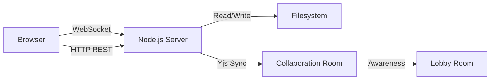
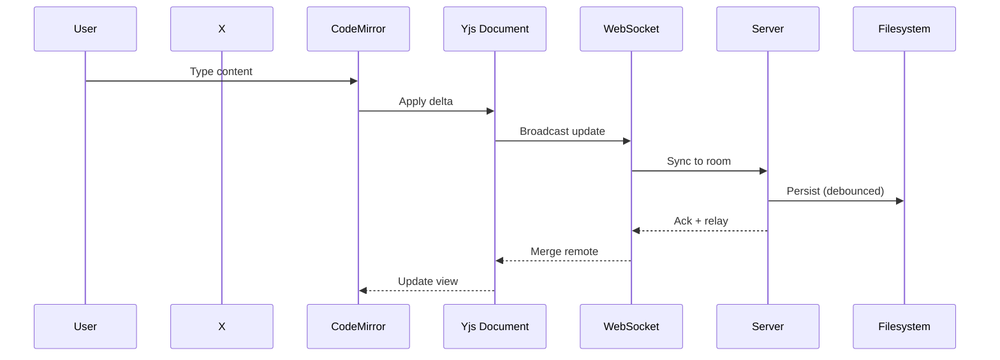
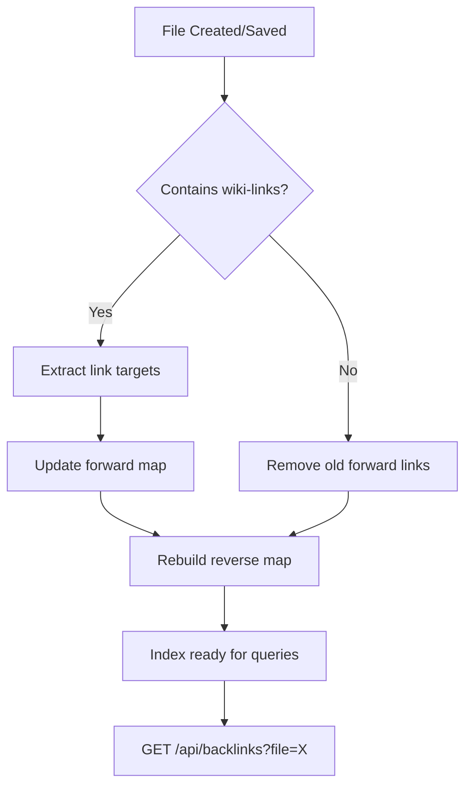
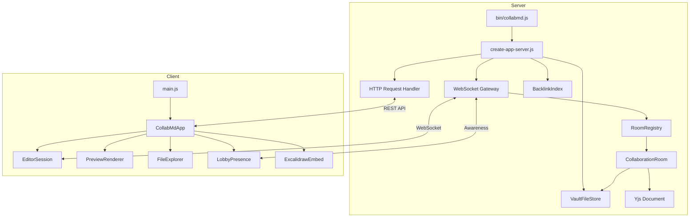
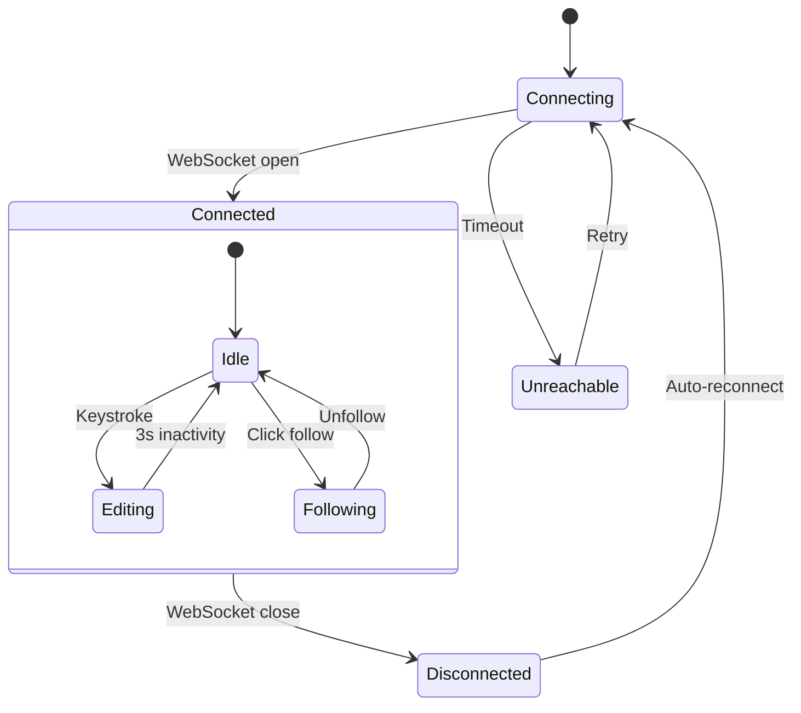
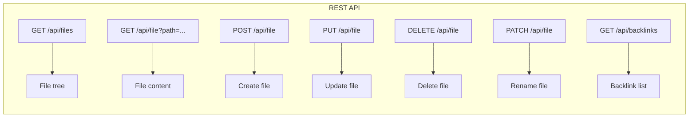
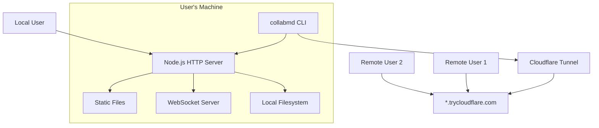
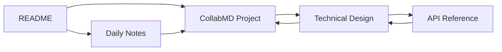
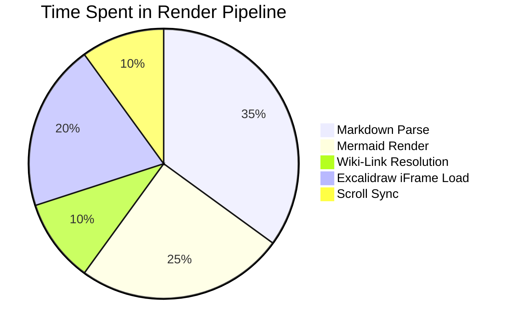

# CollabMD — Technical Design Document

> A collaborative markdown vault with real-time editing, wiki-links, and embedded diagrams.

## Overview

CollabMD turns any folder of markdown files into a collaborative wiki. Multiple users can edit the same file simultaneously through a browser-based editor powered by [[Yjs]] and [[CodeMirror]].

Key features:

- Real-time collaborative editing via WebSocket + Yjs CRDT
- Wiki-link resolution with bi-directional backlinks
- Mermaid diagram rendering
- Excalidraw drawing embeds
- Cloudflare tunnel for instant public

---

## System Architecture

### High-Level Overview



### Detailed Component Diagram

![[sample-excalidraw.excalidraw]]

The diagram above is fully editable — try drawing on it directly in the preview panel.

---

## Data Flow

### File Edit Lifecycle



### Backlink Index Updates



---

## Module Structure

### Server Architecture



### File Type Support

| Type | Extension | Editor | Preview |
|------|-----------|--------|---------|
| Markdown | `.md` | CodeMirror | Rendered HTML |
| Excalidraw | `.excalidraw` | Excalidraw (iframe) | Inline embed |
| Mermaid | fenced block | CodeMirror | SVG diagram |

---

## Collaboration Protocol

### User Presence States



### Awareness Data Structure

Each connected user broadcasts:

```json
{
  "user": {
    "name": "Alice",
    "color": "#818cf8",
    "peerId": "tab-abc123",
    "currentFile": "projects/collabmd.md"
  },
  "cursor": {
    "anchor": 142,
    "head": 142
  }
}
```

---

## API Endpoints



---

## Deployment Architecture



---

## Wiki-Link Resolution

Links are resolved in order:

1. **Exact path match** — `[[projects/collabmd.md]]`
2. **Filename match** — `[[collabmd]]` resolves to `projects/collabmd.md`
3. **Create new** — unresolved links show dashed underline, click to create

### Link Graph Example



The bi-directional arrows show how the backlink index tracks both forward and reverse relationships.

---

## Performance Characteristics



---

*This document itself is a demo of CollabMD's rendering capabilities — Mermaid diagrams, wiki-links, Excalidraw embeds, and standard markdown all working together.*
