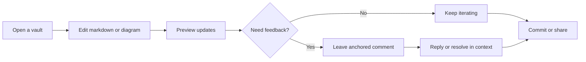
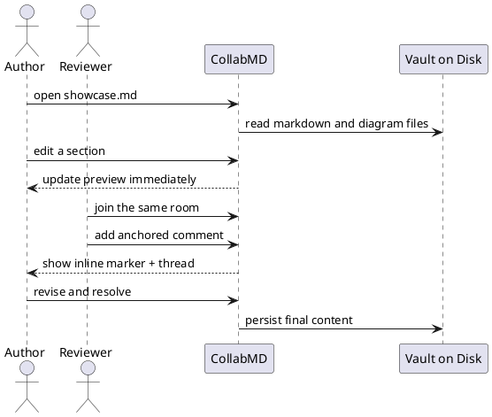
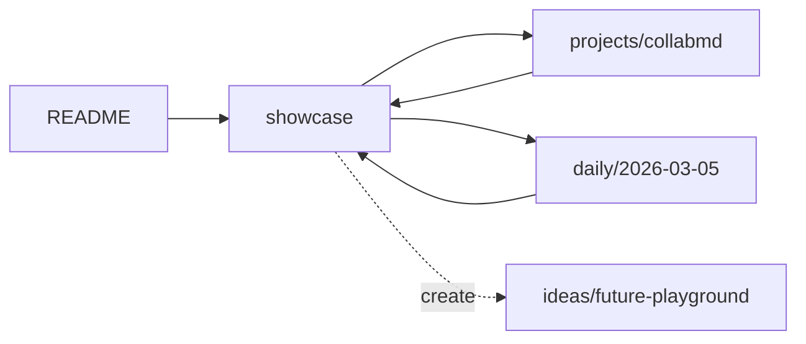

# CollabMD Workspace Tour

> A sample note that demonstrates how one vault can behave like a shared document editor, wiki, and diagram workspace at the same time.

CollabMD is strongest when a note does more than render markdown. It should connect to nearby notes, pull in standalone diagrams, and give collaborators obvious places to discuss changes. This file is written as that kind of note.

## What To Try

1. Keep the editor and preview open side by side.
2. Jump from this note to [[README]], [[projects/collabmd]], and [[daily/2026-03-05]].
3. Open the backlinks and outline panels after navigating around.
4. Add a comment to this note or one of the Mermaid / PlantUML sections below.
5. Try an unresolved link such as [[ideas/future-playground]] to trigger note creation.

## Workspace Surfaces

The app is not only a markdown previewer. It gives the vault several coordinated surfaces:

| Surface | What it shows | Good demo action |
| --- | --- | --- |
| File explorer | The vault as plain folders and files | Open `showcase.md`, then jump to `showcase.excalidraw` |
| Editor + preview | Source text on the left, rendered output on the right | Edit a sentence in this paragraph and watch preview update |
| Wiki links + backlinks | Note relationships across the vault | Follow [[projects/collabmd]] and then inspect backlinks |
| Comments drawer | Source-anchored review threads | Select a sentence in this file and leave a comment |
| Presence / chat | Live collaborators in the same room | Join from a second browser tab or device |
| Quick switcher / outline | Fast movement across files and headings | Jump back here, then use the outline to navigate sections |
| Git panel | Working tree context for docs repos | If this vault is in git, inspect the changes you just made |

This paragraph also exercises common markdown formatting: **bold**, *italic*, `inline code`, ~~strikethrough~~, a direct URL https://github.com/andes90/collabmd, and a standard [external link](https://github.com/andes90/collabmd).

> The important property is that the files remain readable and editable on disk even when the browser is doing much more than a normal markdown viewer.

## Collaboration Loop

The fastest way to understand the app is to think of one editing session from save to review.



The same flow, shown as a text-oriented review sequence:



## Embedded Diagram Files

One useful distinction in CollabMD is that diagrams can live as standalone files instead of being trapped inside a single markdown note.

### Excalidraw

![[showcase.excalidraw|Feature map]]

Open [[showcase.excalidraw]] directly to switch from preview mode into the shared drawing canvas.

### Mermaid

![[showcase-mermaid.mmd|Workspace pipeline]]

### PlantUML

![[showcase-sequence.puml|Review handoff]]

## Vault-Style Linking

This vault is intentionally small so the note graph is easy to inspect:

- [[README]] acts like the front door.
- [[projects/collabmd]] behaves like a project page.
- [[daily/2026-03-05]] gives you a dated note for backlinks and cross-reference testing.
- [[sample-full]] is a denser technical document and still a useful benchmark for how rich one note can be.
- [[ideas/future-playground]] is unresolved on purpose, which makes it useful for the create-new-note flow.

If you want a compact visual representation of the wiki behavior, this fence renders entirely from markdown source:



## Plain Text Still Matters

Even with collaboration features turned on, the raw files remain straightforward:

```json
{
  "file": "showcase.md",
  "links": [
    "README",
    "projects/collabmd",
    "daily/2026-03-05",
    "showcase.excalidraw"
  ],
  "commentable": true,
  "diagramEmbeds": [
    "showcase.excalidraw",
    "showcase-mermaid.mmd",
    "showcase-sequence.puml"
  ]
}
```

## Review Checklist

- [x] Markdown formatting renders in preview
- [x] Wiki links resolve across the vault
- [x] Standalone Mermaid, PlantUML, and Excalidraw files embed cleanly
- [x] This note contains sections that work with the outline panel
- [ ] Add a real comment thread to this file
- [ ] Open the same vault in another browser to test presence or chat

The reason [`sample-full.md`](/Users/andes/Documents/andes/collabmd/test-vault/sample-full.md) feels stronger is that it teaches one coherent story. This note is now aiming for the same thing, but with a product-tour angle instead of a technical-design-doc angle.
